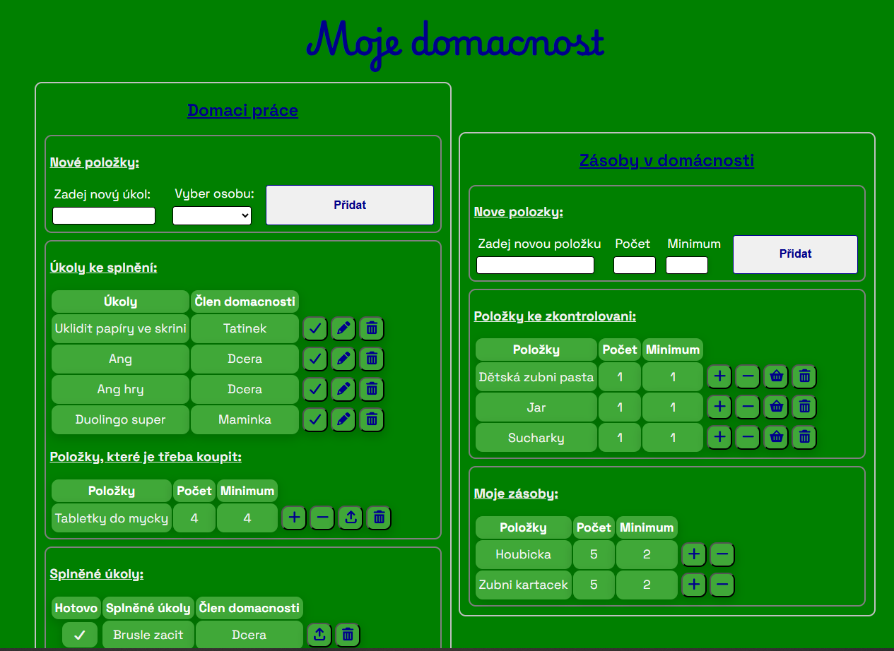

# 🏡 OurHomeProject
Jednoduchá webová aplikace pro přehlednou správu domácích položek a úkolů.  
Umožňuje vytvářet, upravovat a mazat položky, sledovat jejich stav a organizovat si domácí práce na jednom místě.

🌐 **Live demo:** https://ourhomeproject.netlify.app/

---

## ✨ Funkce aplikace
- ➕ Přidání nové položky nebo úkolu  
- ✏️ Úprava existujících položek  
- 🗑️ Mazání položek a úkolů
- 💾 Ukládání dat přes **Supabase**   
- 📱 Responzivní design – použitelný i na telefonu  
- 🎨 Přehledné a intuitivní uživatelské rozhraní (UI)

---

## 🛠️ Použité technologie

- **HTML5**
- **CSS3 / SCSS**
- **JavaScript**
- **React a Vite**
- **Supabase** (PostgreSQL, REST API, autentizace)
- Git & GitHub pro verzování
- Netlify pro deployment / live demo

---

## 🚀 Jak projekt spustit lokálně

### 1. Naklonování repozitáře:
git clone https://github.com/BarbaraStrbikova/muj-projekt

### 2. Přesun do složky projektu:
cd muj-projekt

### 3. Nainstalujte závislosti:
npm install


### 4. Spusťte vývojový server:
npm run dev

- Po spuštění se aplikace otevře na URL, kterou ti Vite zobrazí (např. http://localhost:5173).
- Pokud používáš Supabase, ujisti se, že máš ve složce projektu .env soubor s klíči:

```env
VITE_SUPABASE_URL=tvůj_supabase_url
VITE_SUPABASE_KEY=tvůj_supabase_klíč

- Díky tomu bude aplikace komunikovat s databází a autentizací správně.

🖼️ Náhled aplikace


📁 Struktura projektu
Muj-projekt/
 ├── node_modules/
 ├── public/
 ├── src/
 │   ├── assets
 │   ├── components/
 │   ├── context
 │   └── App.jsx
 ├── package.json
 └── README.md


💡 Co jsem se naučila
  - Práce s React a Vite
  - Používání Supabase
  - Strukturování komponent a stylování s CSS/SCSS
  - Verzování kódu pomocí GitHubu
  - Deployment na Netlify a sdílení live demo

🔧 Plánované vylepšení
    - Optimalizace Supabase databáze – zmenšit počet tabulek a zjednodušit strukturu
    - Přidání dalších stránek, např. „O mně“
    - Omezení přístupu – uzavřít celou aplikaci pouze pro registrované uživatele

👩‍💻 Autor

Barbara Štrbíková
GitHub: https://github.com/BarbaraStrbikova


